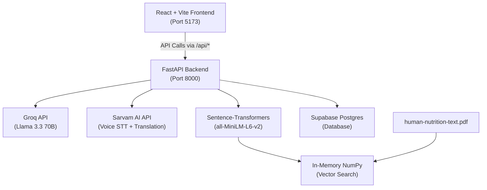
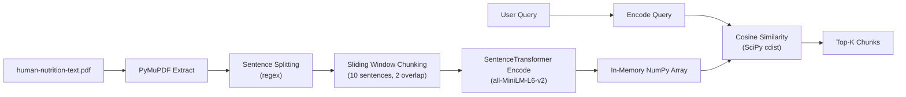
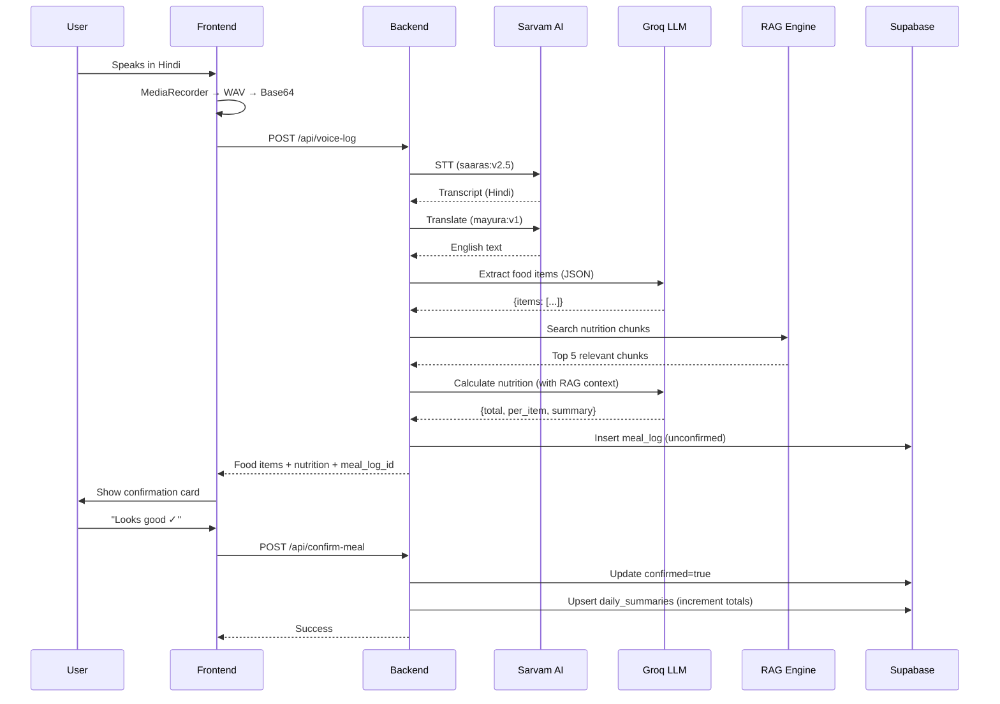

# NutriVoice AI — Complete Codebase Documentation

## Project Overview

**NutriVoice AI** is a real-time, voice-first nutrition companion that listens to what you ate in any Indian language, extracts nutritional data via a RAG (Retrieval-Augmented Generation) pipeline, and delivers personalized health insights through an AI chatbot.

---

## Architecture



---

## Tech Stack

| Layer | Tool | Purpose |
|-------|------|---------|
| **Frontend** | React 18 + Vite 5 | Mobile-first RetroUI-styled SPA |
| **Routing** | react-router-dom 6 | Client-side routing (5 pages) |
| **Icons** | lucide-react | UI icons |
| **Backend** | FastAPI | REST API with async support |
| **LLM** | Groq (Llama 3.3 70B Versatile) | Chat, food extraction, nutrition calc |
| **Voice** | Sarvam AI (saaras:v2.5 + mayura:v1) | Multilingual STT + translation |
| **Embeddings** | all-MiniLM-L6-v2 (384 dims) | Local sentence embeddings |
| **Vector Search** | In-memory NumPy + SciPy | Cosine similarity over PDF chunks |
| **Database** | Supabase Postgres | Meals, summaries, chat, profiles, users |
| **Deployment** | Docker + Railway / Render | Containerized deployment |

---

## File Structure

```
Nutritional RAG/
├── .env                          # API keys (Groq, Sarvam, Supabase)
├── .env.example                  # Template for env vars
├── .gitignore
├── Dockerfile                    # Multi-stage: Python + Node build
├── README.md                     # Setup + deployment guide
├── Production_RAG.ipynb          # Jupyter notebook (original RAG prototype)
├── context for nutritional rag.txt  # Original design spec + Claude conversation
├── human-nutrition-text.pdf      # 26.8 MB nutrition textbook (RAG source)
├── railway.json                  # Railway deployment config
├── render.yaml                   # Render deployment config
├── run_dev.py                    # Launches both backend + frontend for dev
│
├── backend/
│   ├── __init__.py
│   ├── config.py                 # Env vars + RAG config constants
│   ├── main.py                   # FastAPI app with all endpoints
│   ├── requirements.txt          # Python dependencies
│   └── services/
│       ├── __init__.py
│       ├── auth.py               # Custom auth (pbkdf2 hashing, in-memory sessions)
│       ├── database.py           # Supabase CRUD (meals, summaries, chat, profiles)
│       ├── llm.py                # Groq LLM integration (chat, food extraction, nutrition)
│       ├── rag.py                # PDF ingestion, chunking, embedding, search
│       └── voice.py              # Sarvam AI STT + translation
│
└── frontend/
    ├── index.html                # Entry HTML with Google Fonts (Space Mono, Inter)
    ├── package.json              # React 18, react-router-dom, lucide-react
    ├── vite.config.js            # Vite config with proxy to :8000
    └── src/
        ├── main.jsx              # React entry point
        ├── App.jsx               # Root component with routing + bottom nav
        ├── api/
        │   └── client.js         # Fetch-based API client (all endpoints)
        ├── components/
        │   ├── Auth.jsx          # Login/Signup screen
        │   ├── Dashboard.jsx     # Calorie ring, macro bars, recent meals
        │   ├── Chat.jsx          # RAG chatbot with suggestions
        │   ├── VoiceLogger.jsx   # Voice recording + text input + meal confirmation
        │   ├── History.jsx       # Grouped meal history by date
        │   └── Profile.jsx       # User profile settings
        └── styles/
            └── global.css        # RetroUI design system (461 lines)
```

---

## Backend Deep Dive

### Configuration ([config.py](file:///d:/Nutritional%20RAG/backend/config.py))

| Constant | Value | Purpose |
|----------|-------|---------|
| `GROQ_MODEL` | `llama-3.3-70b-versatile` | LLM model for all AI tasks |
| `EMBEDDING_MODEL` | `all-MiniLM-L6-v2` | Local sentence embeddings (384 dims) |
| `CHUNK_SIZE` | 10 sentences | Sentences per chunk |
| `CHUNK_OVERLAP` | 2 sentences | Overlap between chunks |
| `MIN_TOKENS` | 50 | Skip tiny fragments |
| `MAX_TOKENS` | 1300 | Cap chunk size |
| `TOP_K` | 5 | Top results from vector search |

### API Endpoints ([main.py](file:///d:/Nutritional%20RAG/backend/main.py))

| Method | Endpoint | Description |
|--------|----------|-------------|
| `POST` | `/api/auth/signup` | Register new user |
| `POST` | `/api/auth/login` | Login with email/password |
| `POST` | `/api/auth/logout` | Invalidate session |
| `GET` | `/health` | Health check + chunks loaded count |
| `POST` | `/api/chat` | RAG chatbot (query → embed → search → LLM) |
| `POST` | `/api/voice-log` | Voice → STT → translate → extract foods → RAG → nutrition |
| `POST` | `/api/text-log` | Text → extract foods → RAG → nutrition |
| `POST` | `/api/confirm-meal` | Confirm meal log → update daily summary |
| `GET` | `/api/dashboard/{user_id}` | Daily summary + recent meals + profile |
| `GET` | `/api/history/{user_id}` | All meal logs (paginated) |
| `GET` | `/api/profile/{user_id}` | Get user profile |
| `POST` | `/api/profile` | Upsert user profile |
| `GET` | `/{full_path:path}` | Serve frontend static files (production) |

### RAG Pipeline ([rag.py](file:///d:/Nutritional%20RAG/backend/services/rag.py))



Key details:
- **Initialization**: At startup (`lifespan`), extracts the entire PDF, chunks it, and computes all embeddings in-memory
- **Token estimation**: Simple `len(text) // 4` heuristic (no tiktoken dependency at runtime)
- **Search**: Returns top 5 chunks with cosine similarity scores + page numbers

### LLM Service ([llm.py](file:///d:/Nutritional%20RAG/backend/services/llm.py))

Three LLM functions:

1. **`chat_with_context()`** — RAG chatbot
   - Builds system prompt with nutrition reference context + daily intake
   - Maintains last 10 messages of conversation history
   - Temperature: 0.7, Max tokens: 800

2. **`extract_food_items()`** — Food entity extraction
   - Input: translated text → Output: JSON `{items: [{name, quantity, unit, meal_type}]}`
   - Temperature: 0.1 (deterministic), Max tokens: 500
   - Handles markdown code block responses

3. **`get_nutrition_from_context()`** — Nutrition calculation
   - Uses RAG context + food items → structured JSON with per-item and total nutrition
   - Temperature: 0.2, Max tokens: 800

### Voice Service ([voice.py](file:///d:/Nutritional%20RAG/backend/services/voice.py))

Two-step pipeline via Sarvam AI:
1. **STT** (`speech-to-text-translate` endpoint, `saaras:v2.5` model) — WAV audio → transcript
2. **Translation** (`translate` endpoint, `mayura:v1` model) — Non-English transcript → English
   - Skips translation if language already English

### Database Service ([database.py](file:///d:/Nutritional%20RAG/backend/services/database.py))

Supabase tables:

| Table | Key Fields | Purpose |
|-------|-----------|---------|
| `users` | id, email, password_hash, salt | Custom auth (not Supabase Auth) |
| `user_profiles` | id, name, age, weight, height, goals | User preferences |
| `meal_logs` | user_id, food_items (jsonb), nutrition_data (jsonb), confirmed | Meal entries |
| `daily_summaries` | user_id, date, total_calories/protein/carbs/fat/fiber | Aggregated daily totals |
| `chat_messages` | user_id, role, content | Chat history |

Key operations:
- **Meal confirmation** triggers daily summary upsert (increments totals)
- Chat history is retrieved in chronological order (reversed after DESC query)

### Auth Service ([auth.py](file:///d:/Nutritional%20RAG/backend/services/auth.py))

> [!WARNING]
> **Custom auth implementation** — Uses pbkdf2_hmac for password hashing and **in-memory session storage** (dict). Sessions are lost on server restart. Not using Supabase Auth.

- Session tokens: 64-char hex strings, valid for 7 days
- User IDs: 32-char hex strings (not UUIDs)

---

## Frontend Deep Dive

### Design System ([global.css](file:///d:/Nutritional%20RAG/frontend/src/styles/global.css))

**RetroUI Theme** — A retro/neo-brutalist design with hard borders and box shadows:

| Token | Value | Usage |
|-------|-------|-------|
| `--primary` | `#22c55e` (green) | Buttons, progress, active states |
| `--primary-dark` | `#16a34a` | Hover states |
| `--accent` | `#fbbf24` (amber) | Badges |
| `--border` | `#2a2a2a` | Hard 2px borders |
| `--shadow` | `4px 4px 0px #2a2a2a` | Retro box shadow |
| `--font-mono` | Space Mono | Labels, values, monospace text |
| `--font-sans` | Inter | Body text |

Layout: Mobile-first with `max-width: 480px`, fixed bottom nav, 80px bottom padding.

### Components

#### [App.jsx](file:///d:/Nutritional%20RAG/frontend/src/App.jsx) — Root
- Manages auth state via `localStorage('nutrivoice_user')`
- Routes: `/` (Dashboard), `/chat`, `/log`, `/history`, `/profile`
- Bottom nav with 5 icons (Home, Chat, Log, History, Profile)

#### [Auth.jsx](file:///d:/Nutritional%20RAG/frontend/src/components/Auth.jsx) — Login/Signup
- Toggle between Login and Signup modes
- Stores user data in localStorage on success
- Validates email + password (min 6 chars)

#### [Dashboard.jsx](file:///d:/Nutritional%20RAG/frontend/src/components/Dashboard.jsx) — Home Screen
- **ProgressRing**: SVG circular progress for calories (0 → target)
- **MacroBars**: Protein (max 120g), Carbs (max 300g), Fat (max 80g)
- **MealCards**: Recent meals with icons by meal type (🌅🌙☀️🍿)
- Big mic button → navigates to `/log`

#### [VoiceLogger.jsx](file:///d:/Nutritional%20RAG/frontend/src/components/VoiceLogger.jsx) — Food Logging
**State machine**: `idle → recording → processing → confirm → done → idle`

Key features:
- **Audio recording**: MediaRecorder API → WAV encoding (16kHz mono, 16-bit PCM)
- **Resampling**: Linear interpolation to 16kHz if browser records at different rate
- **Base64 encoding**: Chunked (8192 bytes) to avoid call stack overflow
- **Text fallback**: Textarea input for typed food logging
- **Language selector**: 8 Indian languages (Hindi, Tamil, Telugu, English, Kannada, Malayalam, Bengali, Marathi)
- **Confirmation card**: Shows translated text, detected food items, per-item calories, total macros, and summary

#### [Chat.jsx](file:///d:/Nutritional%20RAG/frontend/src/components/Chat.jsx) — RAG Chatbot
- Suggestion chips: "Am I hitting my protein goal?", "What are good iron-rich foods?", etc.
- Chat bubbles with auto-scroll
- Sends last 10 messages as conversation history

#### [History.jsx](file:///d:/Nutritional%20RAG/frontend/src/components/History.jsx) — Meal Timeline
- Groups meals by date (localized to `en-IN`)
- Shows daily total calories per group
- Meal cards with food names, time, type, and calories

#### [Profile.jsx](file:///d:/Nutritional%20RAG/frontend/src/components/Profile.jsx) — User Settings
- Fields: Name, Age, Weight, Height, Activity Level, Dietary Goal, Daily Calorie Target, Preferred Language
- Upserts to Supabase on save
- Logout button (clears localStorage + state)

### API Client ([client.js](file:///d:/Nutritional%20RAG/frontend/src/api/client.js))
- Base URL from `VITE_API_URL` env var (defaults to empty = same origin)
- Fetch wrapper with JSON headers and error extraction
- 10 API methods matching all backend endpoints

---

## Data Flow: Voice Food Logging



---

## Deployment

### Docker
- Multi-stage build: Python 3.11-slim + Node.js 20
- Builds frontend → copies `dist/` to `backend/static/`
- FastAPI serves static files via catch-all route
- Exposes port 8000

### Railway
- Auto-detects Dockerfile
- Start command: `python -m uvicorn backend.main:app --host 0.0.0.0 --port $PORT`
- Health check: `/health`

### Render
- Docker runtime
- Same health check endpoint

### Local Development
```bash
python run_dev.py  # Starts both backend (8000) + frontend (5173)
```
- Vite proxies `/api/*` and `/health` to `http://localhost:8000`

---

## Environment Variables

| Variable | Required | Service |
|----------|----------|---------|
| `GROQ_API_KEY` | ✅ | Groq (LLM) |
| `SARVAM_API_KEY` | ✅ | Sarvam AI (Voice) |
| `SUPABASE_URL` | ✅ | Supabase (Database) |
| `SUPABASE_SERVICE_ROLE_KEY` | ✅ | Supabase (Database) |

---

## Known Issues & Limitations

> [!WARNING]
> **Security Concerns**
> - `.env` file contains live API keys committed to the project
> - In-memory session storage (lost on restart)
> - No CSRF protection
> - Service role key used everywhere (bypasses RLS)
> - Custom auth instead of Supabase Auth
> - `allow_origins=["*"]` CORS policy

> [!NOTE]
> **Performance Notes**
> - PDF ingestion + embedding happens at startup (can take ~1 minute for 26 MB PDF)
> - All embeddings held in memory (RAM-dependent)
> - No caching of LLM responses
> - Hardcoded macro targets in Dashboard (Protein: 120g, Carbs: 300g, Fat: 80g)

> [!IMPORTANT]
> **Missing Supabase Tables**
> The README specifies tables for `user_profiles`, `meal_logs`, `daily_summaries`, `chat_messages` but the auth service also requires a `users` table (not in README SQL) with columns: `id`, `email`, `password_hash`, `salt`, `name`, `created_at`
